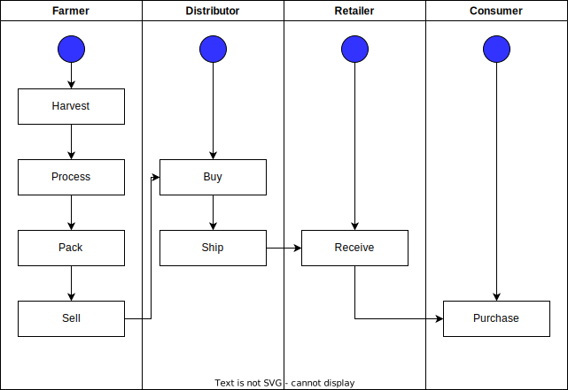
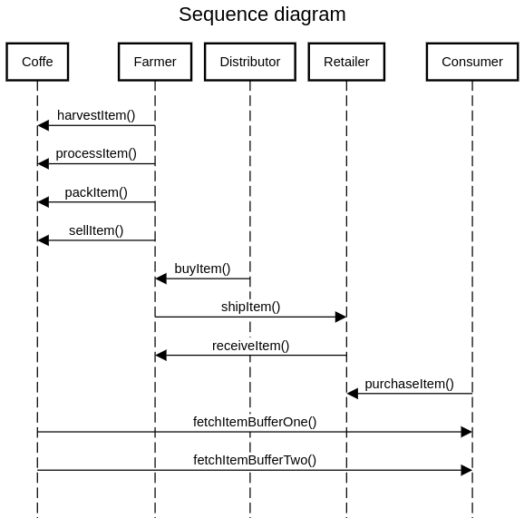
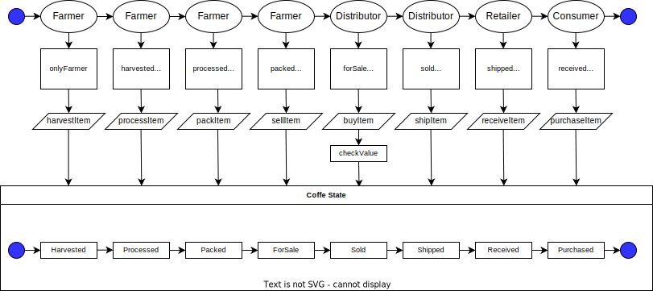
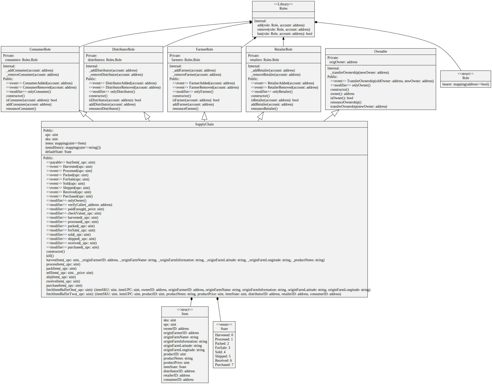

# Supply chain & data auditing

This repository containts an Ethereum DApp that demonstrates a Supply Chain flow between a Seller and Buyer. The user story is similar to any commonly used supply chain process. A Seller can add items to the inventory system stored in the blockchain. A Buyer can purchase such items from the inventory system. Additionally a Seller can mark an item as Shipped, and similarly a Buyer can mark an item as Received.

# Activity diagram


# Sequence diagram


# State diagram


# Class diagram

*generated with sol2uml

# Versions

Node v16.15.0

├── express@4.18.1
├── openzeppelin-solidity@2.3.0
├── sol2uml@1.1.29
├── truffle-hdwallet-provider@1.0.17
├── truffle@5.5.18
├── web3@1.7.3
└── webpack-dev-server@4.9.2

# Libraries

The contract itself uses the Roles.sol library to implement the different roles (Farmer, Distributor, Retailer, Consumer).


# Contract address

The address is 0xc9A05b5266a2a62e7DfdC473c283FB74c27E1607 on Rinkeby. The transaction hash is 0x0df02122f1e1e9c815c5e06da0c148b84dfd11a33712ca6ed847b93ef4e90ff0.
More details on etherscan:

https://rinkeby.etherscan.io/address/0xc9A05b5266a2a62e7DfdC473c283FB74c27E1607

Harvested - 0xbccfb275b10438d565807fb24356169e09fadb68976cb00183c872c753d95998
Processed - 0x85a1d1155b58d0b565731e836830d0b3fbd8b537dde25f3ff15c5d5a67502002
Packed - 0x69628f7e30dcd1a1447dc1e4da8ff0a7a7c832e59739218c01e1146f08796087
ForSale - 0x29e65e6b16ec4426c06b14965410a9f8b30ceaef27818902ea1f55646eebac39
Sold - 0xdac56737d588dc05d88f7f5dedacc84aacb934a09b8dcac03e6b79213eb75eb7
Shipped - 0xf70cb3696ce09b956bff556e3e941158c7e2b9e907ae3b4618f896567ae81de3
Received - 0x0bdbc9c9c364a086984a22349c45e8043940b792d00193a2ff0c717e831a27a5
Purchased - 0x965b39d27416dfe98178d9e2fcd1f60c5498b7023add773c037e89b6e2606484

# IPFS usage

The project is not using IPFS.

# Roles

After deploying the contract on a network, the address which used for deployment has all the roles.

### Prerequisites

Please make sure you've already installed ganache-cli, Truffle and enabled MetaMask extension in your browser.


### Installing

> The code is written for **Solidity v0.4.24**. 

A step by step series of examples that tell you have to get a development env running

Clone this repository and install all requisite npm packages (as listed in ```package.json```):

```
npm install
```

Launch Ganache:

```
ganache-cli -m "spirit supply whale amount human item harsh scare congress discover talent hamster"
```

Your terminal should look something like this:


In a separate terminal window, Compile smart contracts:

```
truffle compile
```

Your terminal should look something like this:


This will create the smart contract artifacts in folder ```build\contracts```.

Migrate smart contracts to the locally running blockchain, ganache-cli:

```
truffle migrate
```

Your terminal should look something like this:


Test smart contracts:

```
truffle test
```

All 11 tests should pass.


In a separate terminal window, launch the DApp:

```
npm run dev
```

